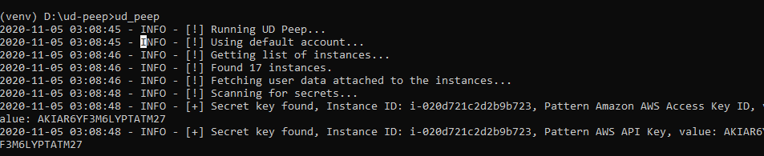

# AWS User Data Secrets Finder

One of the challenges that large orgs face is sometimes ops teams leave sensitive API keys, passwords or secrets inside AWS user data. Leaving those keys there might not directly lead to a vulnerability but any other vulnerability like a full responsive SSRF can be used to extract the secrets. To avoid this it's often suggested not to hardcode credentials there.


UDPeep is a simple command line tool that will allow you to scan your EC2 instances on AWS for secrets. 

## Usage
| Argument        | Required | Description |
| ------------- |:-------------|:-------------|
| -o(output file CSV) | Optional | CSV output for viewing results |
| -r(Role ARN) | Optional | Provide role ARN along to switch account |
| -s(Role Session) | Optional | Role session name to be used |


## Installation

### Clone the repository

```
git clone https://github.com/akhil-reni/ud-peep.git
```

### Install UDPeep

```
python3 setup.py install
```

### Setup your AWS creds - Make sure the IAM role has access to list and view EC2 attributes

```
aws configure
```

###

```
ud_peep
```




## Contributors 

- Prakash Ashok
- Krishna Nuthakki